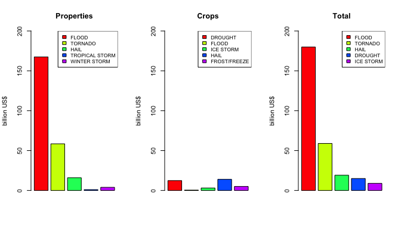
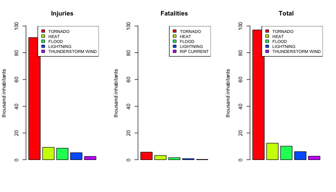

# Reproducible Research: Peer Assessment 2
  
---
  
#Major Weather Events in the US
##and its Economic and Health Impacts, 1950-2011

Author: Daniel Kinpara  
Date: April, 2015  


### 1. Synopsis

The objective of this study is to determine the ten most harmful types of weather events in the United States among the 48 listed in the Storm Data Event Table listed by the National Weather Service (NWS). The criteria used to rank the harmfulness is the injuries and fatalities caused to the population and the economic damages due to weather events. The study will comprehend the period of 1950 to 2011. It will use the National Oceanic & Atmospheric Administration's (NOAA) Storm Data database. For more details of how injuries and fatalities are accounted and economic damages calculated, see the document **Storm Data Preparation** available at [this website](http://www.nws.noaa.gov/directives/).

---

### 2. Data processing

#### 2.1 Loading dataset

The dataset is available in a compressed format (*bz2* extension) from [this link](https://d396qusza40orc.cloudfront.net/repdata%2Fdata%2FStormData.csv.bz2). The file size is 47MB, what consumes time and memory resources to be completed load. In order to speed up the loading process and to use less resources, only nine variables were loaded, as listed below:

1. **BGN-DATE** (character): date and time of the event occurrence ;
2. **EVTYPE** (character): 985 event types when converted to class factor;
3. **FATALITIES** (numeric): number of death, direct or indirect related to the event;
4. **INJURIES** (numeric): number of injuried people;
5. **PROPDMG** (numeric): mantissa of the number of damages to properties;
6. **PROPDMGEXP** (character): exponent of the previous number, coded as:
    - "K", thousand US dollars;
    - "M", million US dollars;
    - "B", billion US dollars;
7. **CROPDMG** (numeric): mantissa of the crop damage;
8. **CROPDMGEXP** (character): exponent of the previous number, same coding of PROPDMGEXP;
9. **REFNUM** (numeric): unique index number.

The following code loads the dataset into **dados**, skipping unused columns. Missing data was assigned *NA*.


```r
dados <- read.csv(bzfile("repdata-data-StormData.csv.bz2"),
                  header = TRUE, na.strings = "NA",
                  colClasses = c("NULL", "character", rep("NULL", 5),
                                 "character", rep("NULL", 4), rep("NULL", 10),
                                 "numeric","numeric", "numeric", "character",
                                 "numeric", "character",rep("NULL", 8),
                                 "numeric"))
```
  
The dataset structure is:


```r
str(dados)
```

```
## 'data.frame':	902297 obs. of  9 variables:
##  $ BGN_DATE  : chr  "4/18/1950 0:00:00" "4/18/1950 0:00:00" "2/20/1951 0:00:00" "6/8/1951 0:00:00" ...
##  $ EVTYPE    : chr  "TORNADO" "TORNADO" "TORNADO" "TORNADO" ...
##  $ FATALITIES: num  0 0 0 0 0 0 0 0 1 0 ...
##  $ INJURIES  : num  15 0 2 2 2 6 1 0 14 0 ...
##  $ PROPDMG   : num  25 2.5 25 2.5 2.5 2.5 2.5 2.5 25 25 ...
##  $ PROPDMGEXP: chr  "K" "K" "K" "K" ...
##  $ CROPDMG   : num  0 0 0 0 0 0 0 0 0 0 ...
##  $ CROPDMGEXP: chr  "" "" "" "" ...
##  $ REFNUM    : num  1 2 3 4 5 6 7 8 9 10 ...
```

#### 2.2 Pre-processing data

Some pre-processing was necessary in order to reduce the number of variables and to allow numerical calculation. Date was extracted from **BGN-DATE** and stored into the variable **tempo**, a class date variable. **PROPDMG** and **PROPDMGEXP** were combined into the numeric variable **urbano**. **CROPDMG** and **CROPDMGEXP** were combined into the numeric variable **rural**. Both were set to the same scale of dollars.
  

```r
dados <- transform(dados, tempo = as.Date(dados$BGN_DATE, "%m/%d/%Y"),
                   urbano = (dados$PROPDMG * 1e9 * (dados$PROPDMGEXP == "B") +
                             dados$PROPDMG * 1e6 * (dados$PROPDMGEXP == "M") +
                             dados$PROPDMG * 1e3 * (dados$PROPDMGEXP == "K") +
                             dados$PROPDMG * (dados$PROPDMGEXP == "")),
                   rural = (dados$CROPDMG * 1e9 * (dados$CROPDMGEXP == "B") +
                            dados$CROPDMG * 1e6 * (dados$CROPDMGEXP == "M") +
                            dados$CROPDMG * 1e3 * (dados$CROPDMGEXP == "K") +
                            dados$CROPDMG * (dados$CROPDMGEXP == "")))
dados <- dados[, c(2:4, 9:12)]
```
  
The new dataset structure is:


```r
str(dados)
```

```
## 'data.frame':	902297 obs. of  7 variables:
##  $ EVTYPE    : chr  "TORNADO" "TORNADO" "TORNADO" "TORNADO" ...
##  $ FATALITIES: num  0 0 0 0 0 0 0 0 1 0 ...
##  $ INJURIES  : num  15 0 2 2 2 6 1 0 14 0 ...
##  $ REFNUM    : num  1 2 3 4 5 6 7 8 9 10 ...
##  $ tempo     : Date, format: "1950-04-18" "1950-04-18" ...
##  $ urbano    : num  25000 2500 25000 2500 2500 2500 2500 2500 25000 25000 ...
##  $ rural     : num  0 0 0 0 0 0 0 0 0 0 ...
```
  
The next step is to clean **EVTYPE**. There are 985 different event types in the database. The non-standard events must be re-classified into the 48 listed event types defined by the NWS. In order to do that, each observation will be compared to the event types in the official list. If there's a match, the event will be assigned as the respective match. Otherwise, the event will be assigned as **NA**. The content of **EVTYPE** had the trailing spaces removed and the letters capitalized before matching.
  

```r
eventTypes <- c("ASTRONOMICAL LOW TIDE", "AVALANCHE", "BLIZZARD", "COASTAL FLOOD",
                "COLD/WIND CHILL", "DEBRIS FLOW", "DENSE FOG", "DENSE SMOKE",
                "DROUGHT", "DUST DEVIL", "DUST STORM", "EXCESSIVE HEAT",
                "EXTREME COLD/WIND CHILL", "FLASH FLOOD", "FLOOD", "FROST/FREEZE",
                "FUNNEL CLOUD", "FREEZING FOG", "HAIL", "HEAT", "HEAVY RAIN",
                "HEAVY SNOW", "HIGH SURF", "HIGH WIND", "HURRICANE (TYPHOON)",
                "ICE STORM", "LAKE-EFFECT SNOW", "LAKESHORE FLOOD", "LIGHTNING",
                "MARINE HAIL", "MARINE HIGH WIND", "MARINE STRONG WIND", 
                "MARINE THUNDERSTORM WIND", "RIP CURRENT", "SEICHE", "SLEET",
                "STORM SURGE/TIDE", "STRONG WIND", "THUNDERSTORM WIND", "TORNADO",
                "TROPICAL DEPRESSION", "TROPICAL STORM", "TSUNAMI", "VOLCANIC ASH",
                "WATERSPOUT", "WILDFIRE", "WINTER STORM", "WINTER WEATHER")
dados <- transform(dados, evento = factor(rep("NA", 902297), levels = eventTypes))
for(i in 1:48){
        match <- grep(eventTypes[i], str_trim(toupper(dados$EVTYPE)))
        dados$evento[match] <- eventTypes[i]
}
listNoMatch <- is.na(dados$evento)
noMatch <- sum(listNoMatch)
noMatchDMG <- round(sum(dados$rural[listNoMatch], dados$urbano[listNoMatch]) / 
                    sum(dados$rural, dados$urbano))
noMatchFatalities <- round(sum(dados$FATALITIES[listNoMatch]) /
                           sum(dados$FATALITIES))
noMatchInjuries <- round(sum(dados$INJURIES[listNoMatch]) /
                           sum(dados$INJURIES))
```
  
After matching, **238,109** observations remained not classified and it was assigned **NA** to them. This represents **0%** of the total observations, **0%** of the total damages (properties + crops), **0%** of the total fatalities, and **0%** of the total injuries. Since there aren't economic and health effects, they will not be used for further computation of impacts. 

The final structure of the data is:
  

```r
dados <- dados[!listNoMatch,3:9]
str(dados)
```

```
## 'data.frame':	664188 obs. of  7 variables:
##  $ FATALITIES: num  0 0 0 0 0 0 0 0 1 0 ...
##  $ INJURIES  : num  15 0 2 2 2 6 1 0 14 0 ...
##  $ REFNUM    : num  1 2 3 4 5 6 7 8 9 10 ...
##  $ tempo     : Date, format: "1950-04-18" "1950-04-18" ...
##  $ urbano    : num  25000 2500 25000 2500 2500 2500 2500 2500 25000 25000 ...
##  $ rural     : num  0 0 0 0 0 0 0 0 0 0 ...
##  $ evento    : Factor w/ 48 levels "ASTRONOMICAL LOW TIDE",..: 40 40 40 40 40 40 40 40 40 40 ...
```
  
---
  
### 3. Results

The data used in the analysis comprehend **664,188** observations of weather events that took place from **01/03/1950** to **11/30/2011**.
  
Along this period, weather events were responsible for **US$ 288,750,676,877** in properties damages and **US$ 40,400,715,591** in crops loses. In terms of health, **129,395** inhabitants were injured, directly or indirectly,  due to weather events. A total of **13,885** souls were lost.

#### 3.1 Economic impacts

The following code will produce the graph of five events that caused more economic damages. Since the impacts have two categories, a panel will three graphs is presented. The graphs computes the properties damages, the crops damages, and the sum of both. It's important to notice that the graph *Total* is the sum of the overall economic damages due to any weather event. It doesn't represent the simple sum of the graph *Properties* and graph *Crops*. The graphs show the damage in terms of billion of dollars.
  

```r
dados <- transform(dados, economico = (urbano + rural))

resUrbano <- with(dados, tapply(urbano, evento, sum))
ord <- order(sapply(resUrbano, "[", 1), decreasing = TRUE)
nomes1 <- names(resUrbano[ord[1:5]])

resRural <- with(dados, tapply(rural, evento, sum))
ord <- order(sapply(resRural, "[", 1), decreasing = TRUE)
nomes2 <- names(resRural[ord[1:5]])

resEcon <- with(dados, tapply(economico, evento, sum))
ord <- order(sapply(resEcon, "[", 1), decreasing = TRUE)
nomes3 <- names(resEcon[ord[1:5]])

x1 <- c(1:5)
y1 <- as.numeric(resUrbano[ord[1:5]])/1e9
y2 <- as.numeric(resRural[ord[1:5]])/1e9
y3 <- as.numeric(resEcon[ord[1:5]])/1e9

par(mfrow = c(1, 3))
barplot(y1, col = rainbow(5), ylim = c(0, 200), axes = TRUE, ylab = "billion US$", main = "Properties")
legend("topright", nomes1, fill = rainbow(5), cex = 0.8)
barplot(y2, col = rainbow(5), ylim = c(0, 200), axes = TRUE, ylab = "billion US$", main = "Crops")
legend("topright", nomes2, fill = rainbow(5), cex = 0.8)
barplot(y3, col = rainbow(5), ylim = c(0, 200), axes = TRUE, ylab = "billion US$", main = "Total")
legend("topright", nomes3, fill = rainbow(5), cex = 0.8)
```

 
  
Observing the *Total* graph, flood is the major cause of economic damages by far. More than twice the damage caused by tornados. The total economic damage caused by flood is **US$ 180**. Tornado accounts for **US$ 58.9**.
  
Damage to properties overcome damage to crops. Crop damages correspond to only **0.123%** of total economic damages. Properties indeed are more affected by flood and tornado. However, crops suffer more from hail and drought. Crops seem to be more damaged by events that have phisyological effects than events that have mechanical effects.
  
#### 4.1 Health impacts
  
The next code will produce the graph of five events that caused more health damages. Health damages are classified as injuries or fatablities. So, as the economic impact graphs, there are three graphs too. The graphs computes the injuries to people, the deaths, and the sum of both in terms of thousand of inhabitants. The graph *Total* is the sum of the overall injuries and deaths. It doesn't represent the simple sum of the graph *Injuries* and graph *Fatalities*.
  

```r
dados <- transform(dados, populacao = (INJURIES + FATALITIES))

resInjuries <- with(dados, tapply(INJURIES, evento, sum))
ord <- order(sapply(resInjuries, "[", 1), decreasing = TRUE)
nomes1 <- names(resInjuries[ord[1:5]])

resFatalities <- with(dados, tapply(FATALITIES, evento, sum))
ord <- order(sapply(resFatalities, "[", 1), decreasing = TRUE)
nomes2 <- names(resFatalities[ord[1:5]])

resPop <- with(dados, tapply(populacao, evento, sum))
ord <- order(sapply(resPop, "[", 1), decreasing = TRUE)
nomes3 <- names(resPop[ord[1:5]])

x1 <- c(1:5)
y1 <- as.numeric(resInjuries[ord[1:5]])/1e3
y2 <- as.numeric(resFatalities[ord[1:5]])/1e3
y3 <- as.numeric(resPop[ord[1:5]])/1e3

par(mfrow = c(1, 3))
barplot(y1, col = rainbow(5), ylim = c(0, 100), ylab = "thousand inhabitants", main = "Injuries")
legend("topright", nomes1, fill = rainbow(5), cex = 0.8)
barplot(y2, col = rainbow(5), ylim = c(0, 100), ylab = "thousand inhabitants", main = "Fatalities")
legend("topright", nomes2, fill = rainbow(5), cex = 0.8)
barplot(y3, col = rainbow(5), ylim = c(0, 100), ylab = "thousand inhabitants", main = "Total")
legend("topright", nomes3, fill = rainbow(5), cex = 0.8)
```

 
  
As the graphs show, tornado is the major cause of injuries and fatalities. Tornado accounts for **97** thousand inahitants with health incidents. More than five times the incidents caused by heat.  Heat accounts for **12.4** thousand inahitants with health incidents.

Different from the economic impacts, the four major causes of health impacts are the same for injuries and fatalities. The only difference is that rip current causes more fatalities than thunderstorm wind. On the other hand, thunderstorm wind causes more injuries than rip current.

It's also noticeable that the proportion of injuries and fatalities is much higher in tornado events than heat events. While there is one fatality to **16** injuried individuals due to tornados, heat proportion is of one fatality to **3** injuried individuals. So, the event of heat is more likely to cause a higher percentage of deaths than the event of a tornado.

---
  
### 4. Final considerations

This analysis was quite superficial and it didn't explore all the possibilities presented by the data available. It's suggested further studies to encompass:
  
- the impact differences among the North American states;
- the change of the weather events severity along time;
- the mitigation of impacts due to a better understanding of the mechanism behind the effect of the weather event over crops and people;
- the relation between the event duration and frequency and the impacts observerd;
- and the recurrence of severe weather events.

Of course, it's not an exhaustive list of possible studies, but they may present a solid base of longitudinal studies in order to stablish trends for the weather events. So, more strategies can be designed to reduce the material and life losses.
